# Enterprise Active Directory Home Lab

## Project Overview

This project documents the deployment and administration of a virtualized Windows Active Directory environment designed to simulate common IT support and system administration responsibilities within a fictional organization, "HK Tech".

The lab was built using **Windows Server 2019** and **Windows 10** virtual machines hosted in **Oracle VirtualBox**.

The environment includes Active Directory Domain Services (AD DS), DNS, DHCP, Group Policy, PowerShell automation, security groups, domain-joined workstations, SMB file sharing, and role-based resource permissions.

The lab initially began as a foundational Active Directory environment and was later expanded into a more structured enterprise-style environment. This included creating departmental Organizational Units (OUs), provisioning users, implementing security groups, configuring domain workstations, deploying Group Policy security controls, creating departmental file shares, and testing authorized and unauthorized resource access.

### Project Goals

- Deploy a Windows Server 2019 Domain Controller
- Configure Active Directory Domain Services (AD DS)
- Configure DNS and DHCP services
- Design an enterprise-style Organizational Unit (OU) structure
- Create and manage Active Directory users and computers
- Automate bulk user provisioning using PowerShell
- Implement departmental security groups
- Join Windows 10 workstations to the domain
- Configure centralized workstation policies using Group Policy
- Implement workstation security controls
- Configure SMB departmental file sharing
- Implement group-based access permissions
- Test authorized and unauthorized access to network resources
- Practice network, DNS, Active Directory, Group Policy, and permissions troubleshooting
- ---

## Lab Environment & Architecture

The lab was built in Oracle VirtualBox to simulate a small corporate Windows domain environment. A Windows Server 2019 virtual machine serves as the Domain Controller and provides centralized identity and network services, while two Windows 10 virtual machines represent departmental employee workstations.

### Virtual Machines

| Virtual Machine | Operating System | Purpose |
|---|---|---|
| DC | Windows Server 2019 | Domain Controller hosting AD DS, DNS, DHCP, Group Policy, and File Services |
| HK-IT-001 | Windows 10 | Domain-joined workstation representing the IT department |
| HK-CS-001 | Windows 10 | Domain-joined workstation representing the Customer Support department |
### Virtual Lab Environment

The lab was virtualized using Oracle VirtualBox and consists of one Windows Server 2019 Domain Controller and two Windows 10 workstations representing different departments.

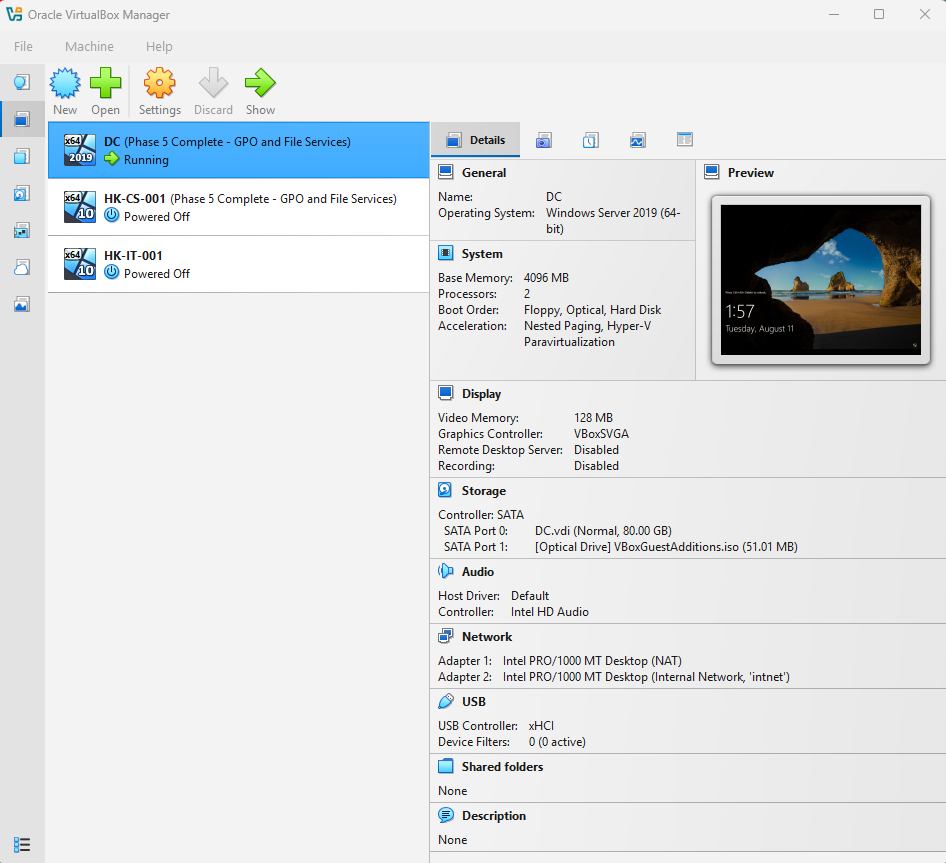

### Network Configuration

The Domain Controller uses two virtual network adapters:

- **NAT Adapter:** Provides connectivity outside of the isolated lab network.
- **Internal Network Adapter:** Provides communication between the Domain Controller and domain workstations.

The internal Active Directory network uses the `172.16.0.0/24` subnet.

| Configuration | Value |
|---|---|
| Domain | `mydomain.com` |
| Domain Controller | `DC` |
| DC Internal IP Address | `172.16.0.1` |
| Internal Network | `172.16.0.0/24` |
| DHCP Address Pool | `172.16.0.100 - 172.16.0.200` |
| DNS Server | `172.16.0.1` |
| IT Workstation | `HK-IT-001` |
| Customer Support Workstation | `HK-CS-001` |

### Domain Controller Network Configuration

The Domain Controller was configured with a static internal IP address of `172.16.0.1` on the `172.16.0.0/24` network. This interface provides internal network connectivity and DNS services for domain-joined workstations.

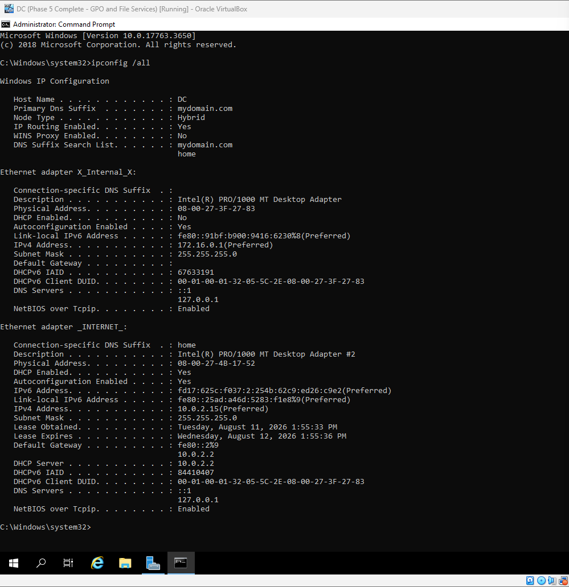
## Windows Server Roles & Services

Windows Server 2019 was configured as the central server for the Active Directory lab environment. Multiple server roles were installed and configured to provide centralized authentication, name resolution, IP address assignment, policy management, and network resource access.

The server provides the following core services:

- **Active Directory Domain Services (AD DS):** Provides centralized management and authentication for domain users and computers.
- **DNS:** Resolves domain names and allows clients to locate Active Directory services.
- **DHCP:** Automatically assigns network configuration to client workstations.
- **Group Policy:** Provides centralized configuration and security policies for domain computers.
- **File Services:** Provides shared network resources with controlled access permissions.
- **Remote Access:** Provides routing functionality between the internal lab network and external network connection.

### Server Roles

The Server Manager dashboard confirms the primary roles and services installed on the Windows Server 2019 Domain Controller.

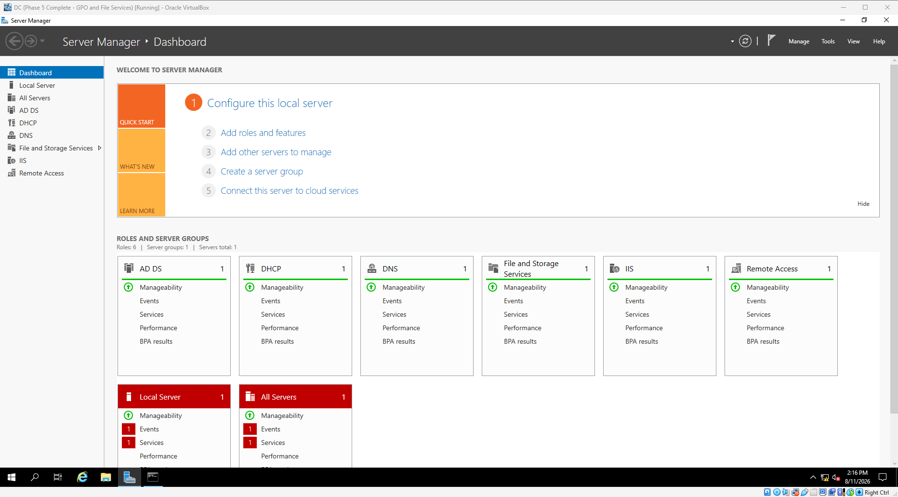

### DNS Configuration

DNS was configured alongside Active Directory Domain Services to provide name resolution for the `mydomain.com` domain.

The DNS forward lookup zone contains records for the Domain Controller and domain-joined workstations, allowing systems to locate network resources by hostname rather than relying solely on IP addresses.

Examples include:

- `DC` → `172.16.0.1`
- `HK-CS-001` → `172.16.0.102`
- `HK-IT-001` → `172.16.0.103`

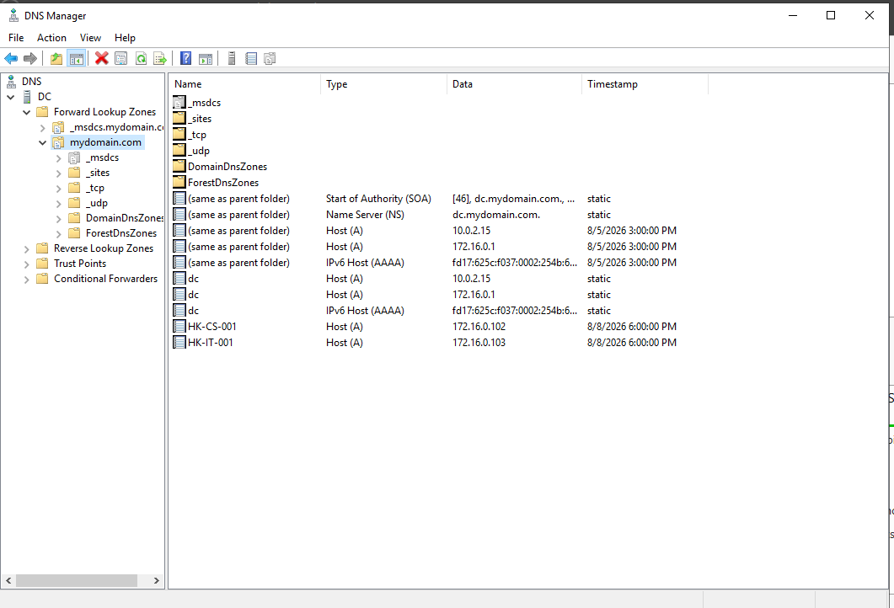
### DHCP Configuration

DHCP was configured on the Domain Controller to automatically provide IP addressing and network configuration to client systems on the internal network.

A DHCP scope was created for the `172.16.0.0/24` network with an address pool ranging from `172.16.0.100` to `172.16.0.200`.

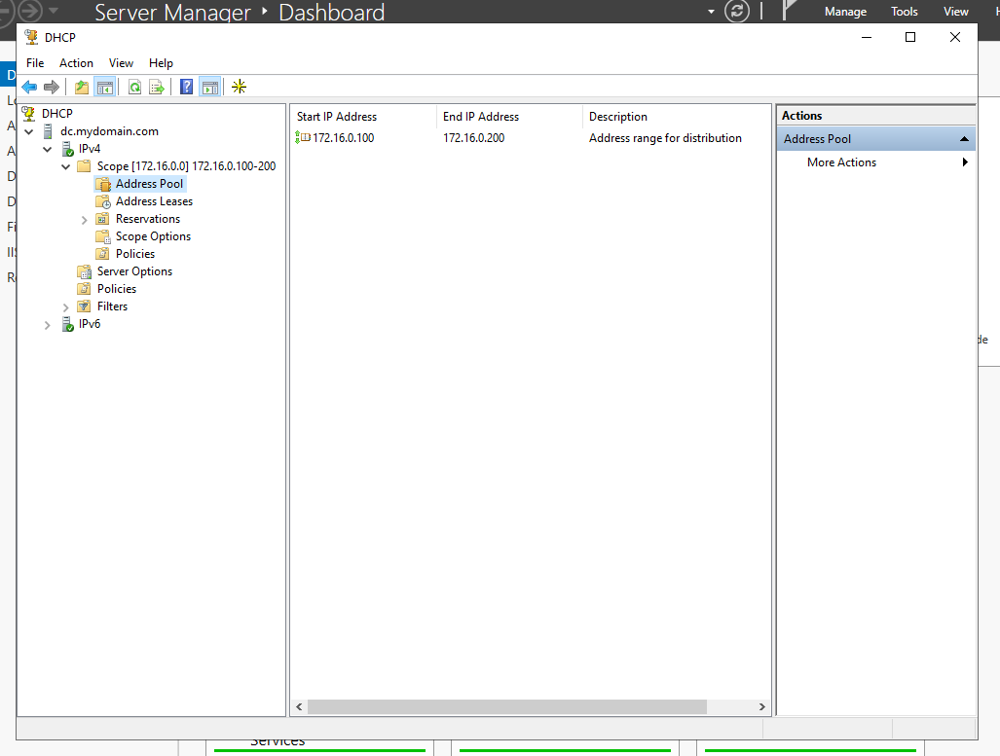

The DHCP lease table verifies that client workstations successfully received addresses from the configured scope, including the departmental workstations `HK-CS-001` and `HK-IT-001`.

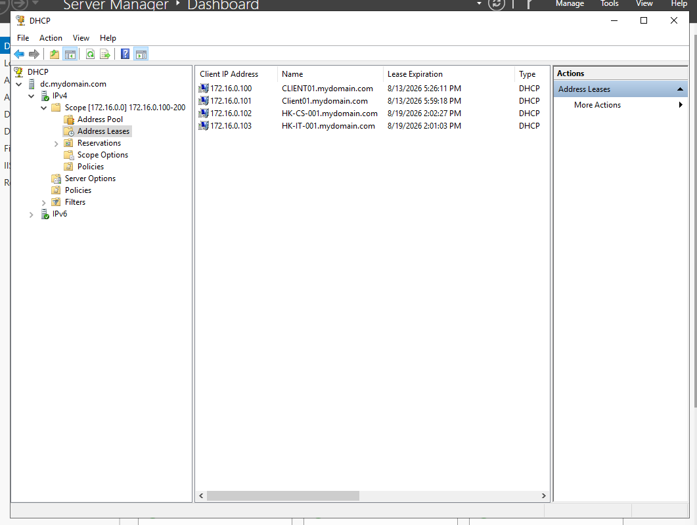

DHCP scope options were also configured to distribute the required network settings to clients:

- **Router:** `172.16.0.1`
- **DNS Server:** `172.16.0.1`
- **DNS Domain Name:** `mydomain.com`

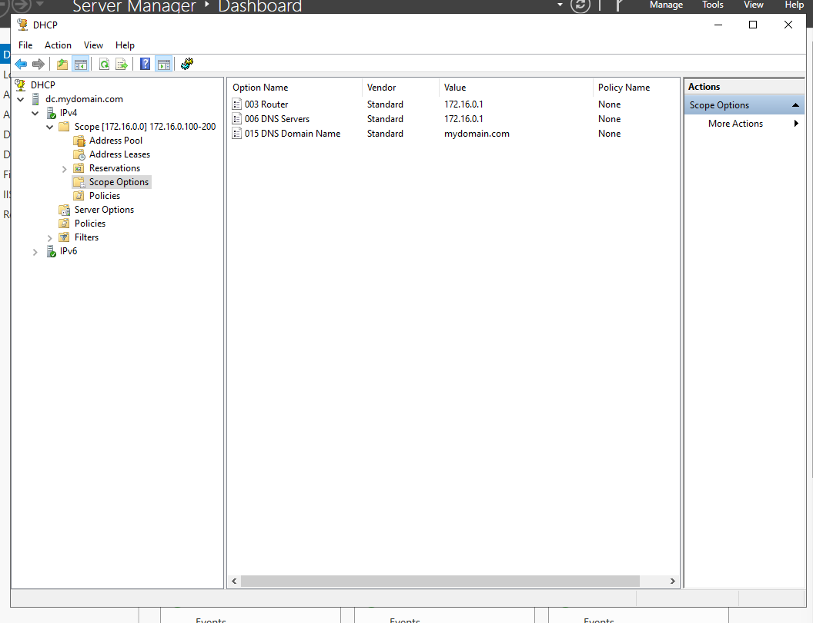

## Active Directory Structure & User Management

After establishing the domain infrastructure, Active Directory was expanded into an enterprise-style environment representing the fictional organization **HK Tech**.

Organizational Units (OUs) were created to logically separate users, computers, administrative accounts, service accounts, and other resources. This structure allows administrators to organize Active Directory objects and apply policies or permissions to specific parts of the organization.

### Organizational Unit Structure

The `HK Tech` OU was created as the primary organizational structure for the simulated company.

The environment was separated into several major OUs, including:

- **Admin Accounts** – Administrative and privileged accounts
- **Computers** – Domain-joined workstation objects
- **Disabled Users** – Accounts that have been disabled
- **Groups** – Active Directory security groups
- **Resources** – Organizational network resources
- **Servers** – Server computer objects
- **Service Accounts** – Accounts used by services or applications
- **Users** – Employee accounts organized by department

Within the Users OU, additional departmental OUs were created, including Customer Support, Engineering, Executive, Finance, Human Resources, IT, Marketing, and Sales.

This structure simulates how Active Directory can be organized to simplify administration and separate users and resources based on business function.

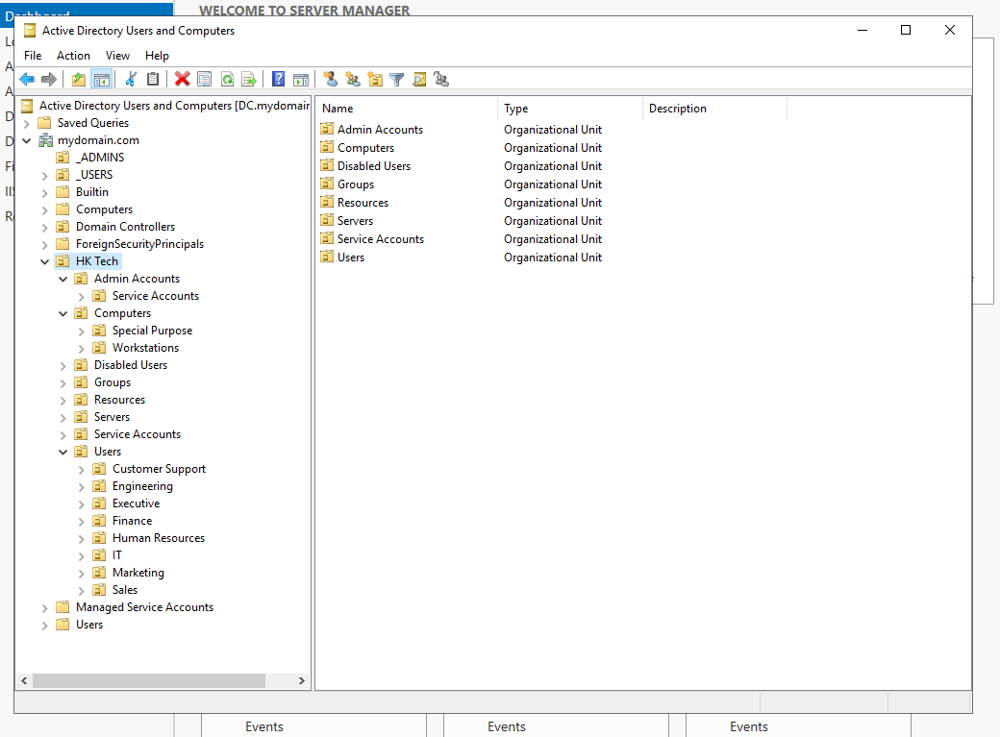

### User Account Management

User accounts were created and organized into their appropriate departmental Organizational Units.

For example, IT department employees were placed within the `HK Tech/Users/IT` OU. Organizing accounts by department provides a structured way to manage users and supports future assignment of department-specific security groups, permissions, and policies.

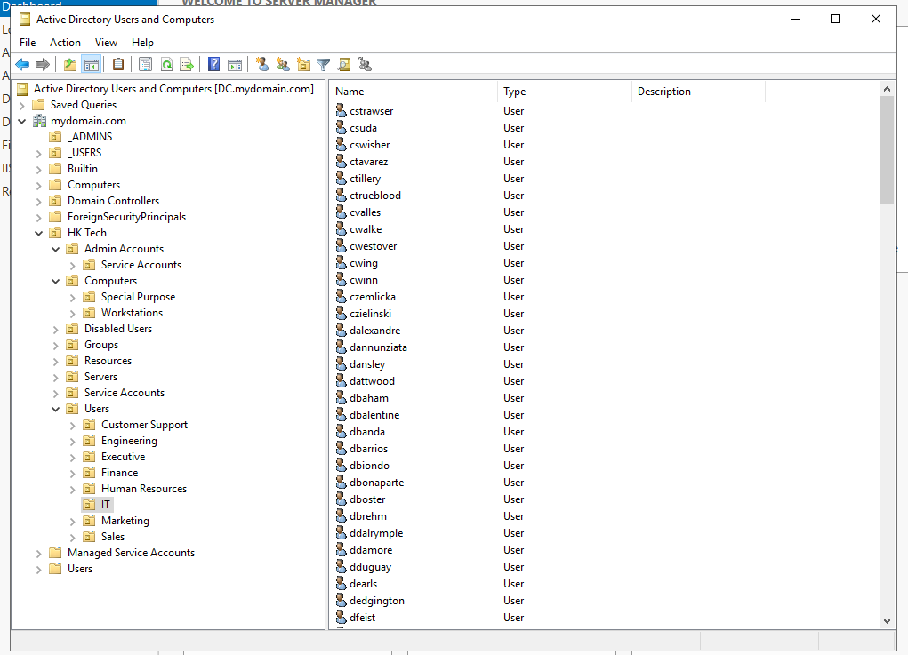

The lab also included common user administration tasks such as creating accounts, organizing users into departments, managing group membership, and disabling accounts when access was no longer required.

## PowerShell User Provisioning

To simulate user administration at a larger organizational scale, PowerShell was used to automate the creation of Active Directory user accounts.

Rather than manually creating each account through Active Directory Users and Computers (ADUC), bulk user provisioning was performed using PowerShell and Active Directory cmdlets. This demonstrated how scripting can reduce repetitive administrative work and improve efficiency when managing a larger directory environment.

### Bulk User Creation

The PowerShell provisioning process was used to:

- Create Active Directory user accounts in bulk
- Assign usernames and account information
- Configure initial account credentials
- Enable newly created accounts
- Populate Active Directory with a larger simulated workforce
- Support the later organization of users into departmental OUs and security groups

PowerShell ISE was used to review, execute, and troubleshoot the provisioning script.

After provisioning, the accounts were verified through Active Directory Users and Computers and organized into the appropriate departmental structure.

### PowerShell Experience

PowerShell was used as part of the lab to perform bulk Active Directory user provisioning. This provided introductory hands-on experience with using PowerShell for Windows and Active Directory administration.

Through this process, I gained experience with:

- Running PowerShell and PowerShell ISE with administrative privileges
- Executing Active Directory provisioning scripts
- Understanding the purpose of basic Active Directory PowerShell commands
- Troubleshooting script execution and file path issues
- Using automation to reduce repetitive account creation tasks
- Verifying script results through Active Directory Users and Computers

- ## Security Groups & Group-Based Access Control

Active Directory security groups were created to manage users based on their department and job responsibilities.

Instead of assigning permissions individually to every user, accounts can be placed into security groups and access can then be assigned to the appropriate group. This provides a more centralized and scalable approach to managing access.

### Department and Role-Based Security Groups

Global Security Groups were created for departments and IT-related roles within HK Tech.

Examples include:

- `GG_CustomerSupport_Users`
- `GG_Engineering_Users`
- `GG_Finance_Users`
- `GG_HR_Users`
- `GG_IT_Users`
- `GG_Marketing_Users`
- `GG_Sales_Users`
- `GG_HelpDesk`
- `GG_NetworkAdmins`
- `GG_SecurityAnalysts`
- `GG_SystemAdmins`

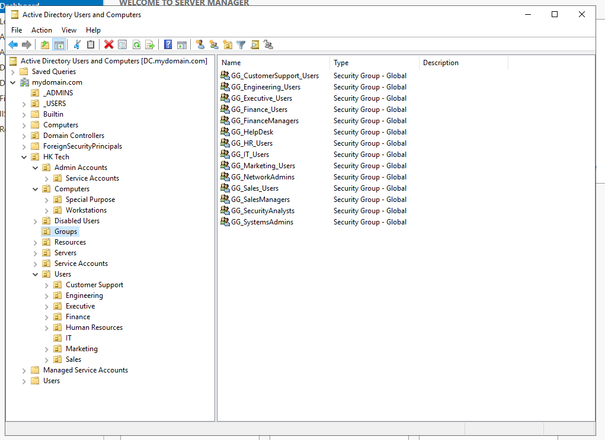

### Group Membership

Users were assigned to security groups based on their department or responsibilities.

For example, IT department users were assigned to the `GG_IT_Users` security group. Managing access through groups allows administrators to modify a user's access by changing group membership rather than configuring permissions individually on multiple resources.

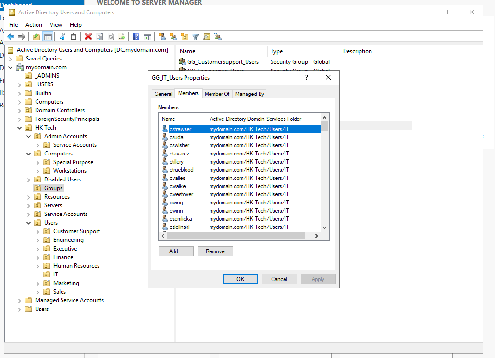

### Why Group-Based Access Matters

Using security groups provides several administrative and security benefits:

- Centralizes permission management
- Reduces repetitive permission assignments
- Makes user access easier to review
- Supports department and role-based access
- Simplifies onboarding, transfers, and offboarding
- Helps support the principle of least privilege

Later in this project, these security groups are used to control access to departmental network resources. For example, members of the Customer Support security group are permitted to access the Customer Support shared folder, while unauthorized users from other departments are denied access.

## Domain-Joined Workstations

Windows 10 Pro workstations were configured and joined to the `mydomain.com` Active Directory domain to simulate employee computers within the HK Tech environment.

Two departmental workstations were used:

- **HK-IT-001** – IT department workstation
- **HK-CS-001** – Customer Support department workstation

### Domain Integration

Before joining the workstations to the domain, the clients were configured to use the Domain Controller (`172.16.0.1`) as their DNS server. This allows the clients to locate the Domain Controller and other Active Directory services.

After joining the domain, the computer objects were moved into the `HK Tech > Computers > Workstations` Organizational Unit.

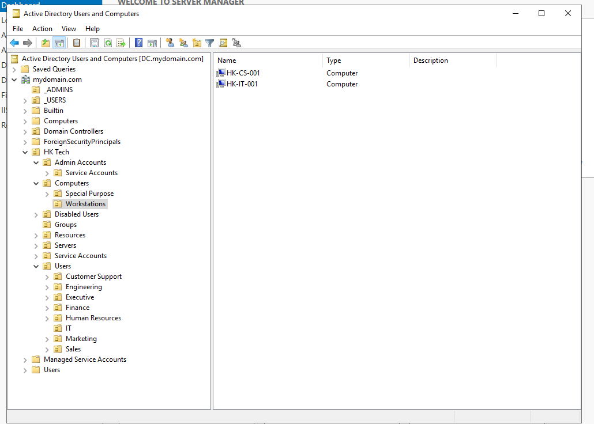

Placing the computer objects within the Workstations OU provides a centralized location for managing domain workstations and allows workstation-specific Group Policies to be applied to those systems.

### Workstation Configuration Process

The general workstation configuration process included:

1. Deploying Windows 10 Pro virtual machines in VirtualBox
2. Connecting the workstations to the internal virtual network
3. Receiving network configuration from the DHCP server
4. Configuring the Domain Controller as the DNS server
5. Renaming the computers to identify their department and purpose
6. Joining the computers to the `mydomain.com` domain
7. Verifying the computer objects in Active Directory
8. Moving the computer objects into the Workstations OU
9. Signing in using Active Directory domain accounts

## Group Policy & Workstation Security

Group Policy was used to centrally configure and enforce workstation settings across the HK Tech domain environment.

A Group Policy Object (GPO) named `HK Tech - Workstation Baseline` was created and linked to the `Workstations` Organizational Unit. Because the domain workstations are located within this OU, the baseline can be centrally applied to those systems.

### Workstation Baseline GPO

The `HK Tech - Workstation Baseline` GPO was linked to the Workstations OU to provide a centralized security configuration for domain-joined employee computers.

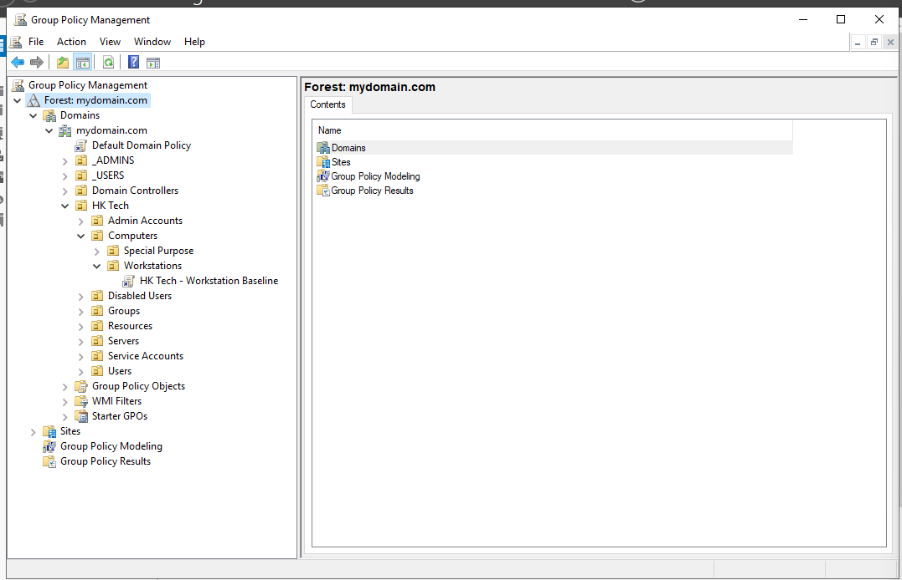

### Security Baseline Configuration

Several workstation security settings were configured through the baseline GPO.

The implemented settings included:

- **Guest account disabled** to prevent use of the built-in Guest account
- **Built-in Administrator account renamed** to `HK-LocalAdmin`
- **Anonymous SID/Name translation disabled**
- **Machine inactivity limit set to 600 seconds (10 minutes)**
- **Detailed system status messages enabled**
- **Removable disk write access denied**
- **Microsoft Defender real-time protection kept enabled**
- **Microsoft Defender behavior monitoring enabled**

These settings demonstrate how Group Policy can be used to establish consistent workstation configurations from a central location instead of manually configuring each endpoint.

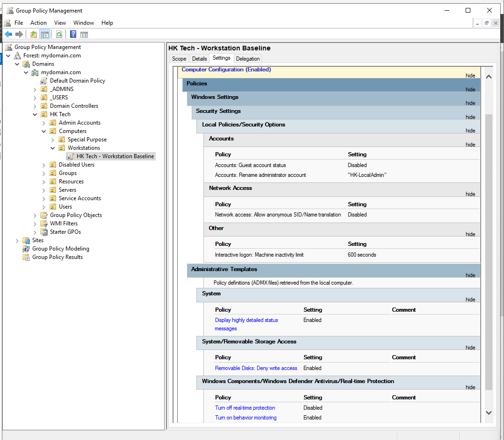

### Group Policy Verification

After configuring and linking the workstation baseline, Group Policy application was verified from the `HK-IT-001` workstation.

The following command was used:

`gpresult /r /scope computer`

The results confirmed that `HK Tech - Workstation Baseline` was included in the workstation's applied Group Policy Objects.

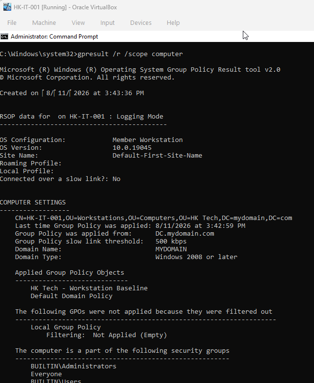

### Why Centralized Group Policy Matters

Using Group Policy allows administrators to:

- Apply consistent configurations across multiple domain computers
- Centrally manage workstation security settings
- Reduce manual endpoint configuration
- Update policies from the domain rather than configuring each workstation individually
- Organize policy deployment through Active Directory OUs
- Verify policy application when troubleshooting workstation configuration issues

This portion of the lab demonstrated the relationship between Active Directory computer organization, Group Policy deployment, endpoint security configuration, and client-side policy verification.

## Troubleshooting & Lessons Learned

Throughout the deployment and expansion of the Active Directory environment, I encountered several configuration and connectivity issues that required troubleshooting. Resolving these issues provided practical experience diagnosing problems across Active Directory, DNS, networking, Group Policy, PowerShell, and file permissions.

### DNS and Domain Connectivity

One of the primary issues encountered involved DNS configuration on the Windows 10 client systems. A workstation was initially configured with an incorrect DNS server inherited from the VirtualBox NAT network.

Because Active Directory relies heavily on DNS, incorrect DNS configuration can prevent clients from locating the Domain Controller and joining or communicating with the domain correctly.

**Troubleshooting performed:**

- Reviewed client IP configuration
- Verified connectivity to the Domain Controller using `ping`
- Verified domain name resolution by pinging `dc.mydomain.com`
- Identified incorrect DNS configuration
- Configured the client to use the Domain Controller (`172.16.0.1`) for DNS
- Retested domain connectivity and name resolution

This reinforced the importance of verifying DNS early when troubleshooting Active Directory connectivity.

### Domain Join Troubleshooting

During the initial workstation configuration, I encountered difficulty joining a Windows 10 client to the domain.

Troubleshooting included verifying:

- Network connectivity between the client and Domain Controller
- Correct DNS configuration
- Domain name resolution
- Administrative credentials
- Windows system configuration

After correcting the network and DNS configuration, the workstation successfully joined the `mydomain.com` domain.

### PowerShell Script Execution

While performing bulk user provisioning, the PowerShell provisioning script initially failed because it was being executed from an incorrect file path.

The issue was resolved by locating the correct script directory, opening PowerShell ISE with administrative privileges, and executing the script from the appropriate location.

This provided introductory experience troubleshooting PowerShell script execution and reinforced the importance of understanding file paths, permissions, and administrative privileges.

### Group Policy Verification

After configuring the `HK Tech - Workstation Baseline` GPO, I verified that the policy was actually being received by the workstation rather than assuming that creating and linking the GPO was sufficient.

The following command was used:

`gpresult /r /scope computer`

The output confirmed that `HK Tech - Workstation Baseline` was successfully applied to the `HK-IT-001` workstation.

This demonstrated the importance of validating configuration changes from the client side when troubleshooting Group Policy.

### File Permission Troubleshooting

Access to the Customer Support SMB share was tested using users from different departments.

A Customer Support user successfully accessed the shared resource, while an IT user received an access-denied message.

Before modifying permissions, the user's identity and department were considered to determine whether the user should actually have access.

Because the IT account was not authorized to access the Customer Support resource, the access-denied result confirmed that the permissions were functioning correctly.

This demonstrated that troubleshooting permissions does not always mean granting additional access. Administrators must first determine whether the requested access is appropriate.

### Key Lessons Learned

This project reinforced several important IT administration and troubleshooting concepts:

- Verify basic network connectivity before investigating higher-level services
- Check DNS configuration early when troubleshooting Active Directory
- Understand the relationship between DHCP, DNS, Active Directory, and domain clients
- Use Organizational Units to logically organize users and computers
- Use security groups instead of assigning permissions individually
- Apply least-privilege principles when managing access
- Verify Group Policy from the client rather than assuming it applied successfully
- Test both authorized and unauthorized access when validating permissions
- Use PowerShell automation to reduce repetitive administrative tasks
- Document configuration changes and troubleshooting steps
- Verify a user's identity and authorization before modifying access

## Skills & Technologies

Through this project, I gained hands-on experience with:

**Operating Systems**
- Windows Server 2019
- Windows 10

**Active Directory**
- Active Directory Domain Services (AD DS)
- Active Directory Users and Computers (ADUC)
- Organizational Units
- User and computer account management
- Security groups
- Domain joining

**Networking**
- IPv4 addressing
- DNS
- DHCP
- NAT and internal virtual networking
- Network connectivity testing
- Name resolution troubleshooting

**Windows Administration**
- Windows Server Manager
- Group Policy Management
- Group Policy troubleshooting
- SMB file sharing
- NTFS permissions
- Group-based access control

**Tools**
- Oracle VirtualBox
- PowerShell / PowerShell ISE
- Command Prompt
- `ipconfig`
- `ping`
- `gpresult`

## Project Outcome

The completed lab simulates several responsibilities commonly performed in Windows-based IT support and system administration environments.

Starting from a foundational Active Directory lab, the environment was expanded to include an enterprise-style OU structure, departmental users and security groups, domain-joined workstations, centralized Group Policy configuration, automated user provisioning, DNS and DHCP services, and departmental file sharing with access controls.

The final environment demonstrates the ability to configure, administer, test, and troubleshoot a small Windows domain while applying concepts such as centralized management, group-based permissions, least privilege, and structured troubleshooting.

## Credits & References

The initial Active Directory lab foundation was based on a tutorial by Josh Madakor. The environment was subsequently expanded with additional organizational structure, departmental users and security groups, domain workstations, Group Policy configurations, file services, access-control testing, and troubleshooting scenarios.

Original tutorial: Josh Madakor – Active Directory Home Lab
